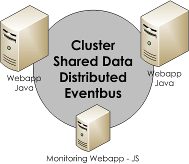

class: title
background-image: url(red.jpg)

# Vert.x 3

---
class: subtitle
background-image: url(pantone.jpg)

# Vert.x 3 New Features
##  Erwin de Gier
### Amsterdam, September 2015

---

# Agenda

1. What's Vert.x ?
2. Vert.x core API
3. Distributed Eventbus
4. REST
5. Authentication / Authorisation
6. MongoDB
7. Vert.x unit
8. Conclusion

---

# What's Vert.x ?

##Vert.x is a tool-kit for building reactive applications on the JVM.

---

# Vert.x features

* Event driven and non-blocking (scalable)
* Polyglot (Java, JavaScript, Groovy, Ruby, etc.)
* Distributed event-bus
* Shared data
* Microservices
* Async MySQL, Redis, PostgreSQL, MongoDB, etc.
* Async file io


---
# Example deployment
.center[]

---
# Vert.x core API
Java:
```java
public class MyVerticle extends AbstractVerticle {
	public void start() throws Exception {
		vertx.setPeriodic(1000,  arg -> {
			vertx.eventBus().publish("event", 
			new JsonObject().put("eventmessage", "hello"));
		});
	}
}
```
JavaScript:
```js
var eb = vertx.eventBus();
eb.consumer("event", function (message) {
  console.log("Received message: " + message.body().eventmessage);
});
```
Starting a verticle:
```java
$vertx run MyVerticle -cluster
$vertx run monitor.js -cluster
```
---
# Shared data
